# Graf struktury aplikace - Orel Bořitov

## Datový model - Entity Relationship Diagram

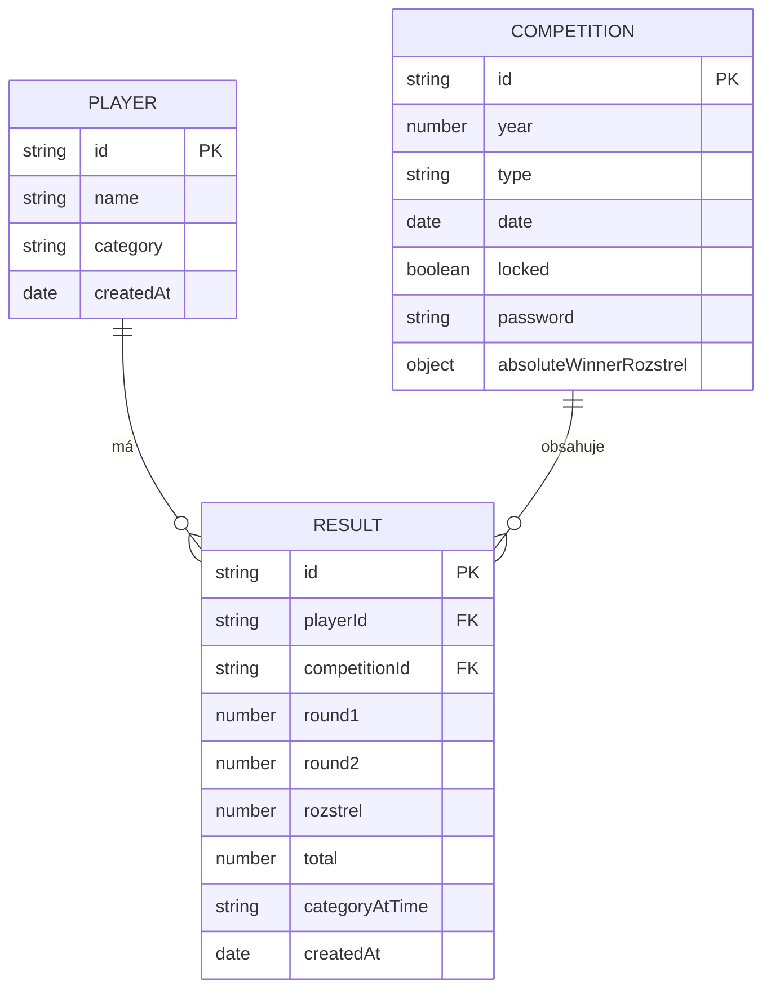

## Procesní tok - Kompletní workflow

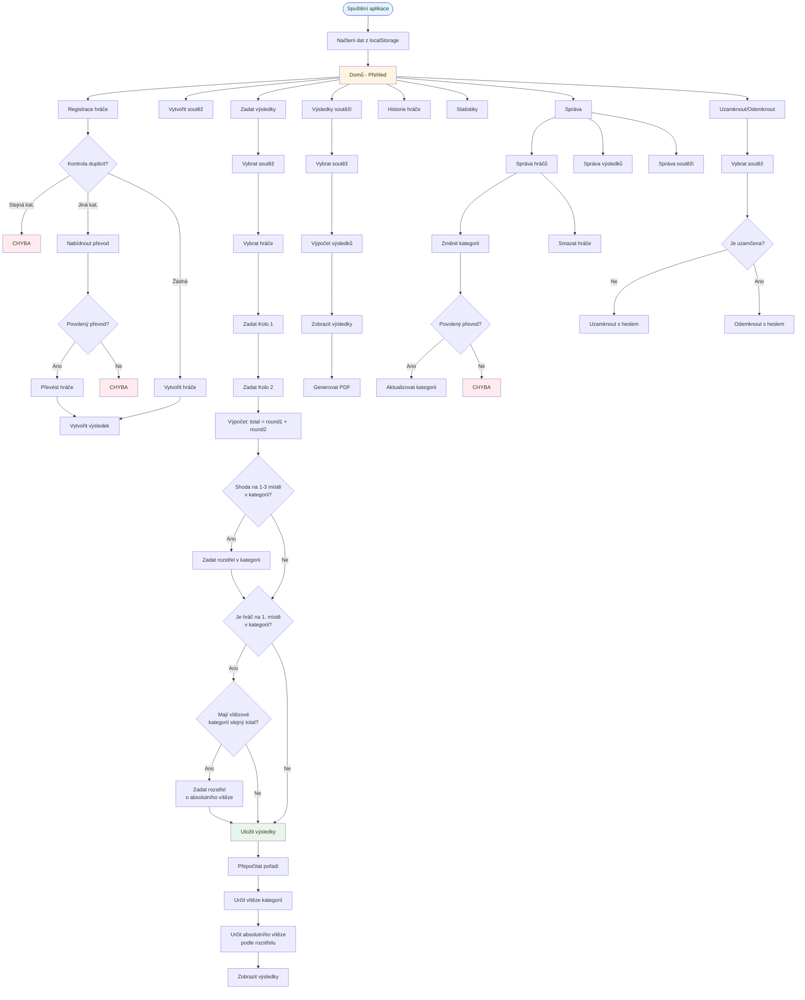

## Hierarchie kategorií a přechody

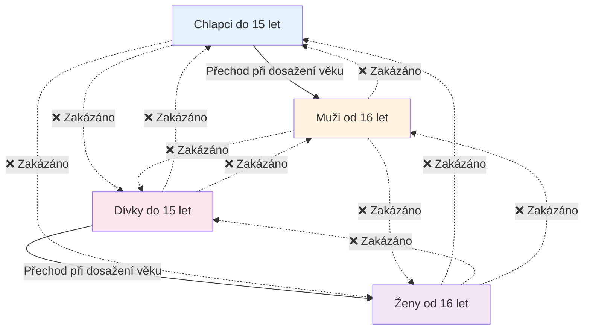

## Proces určení absolutního vítěze

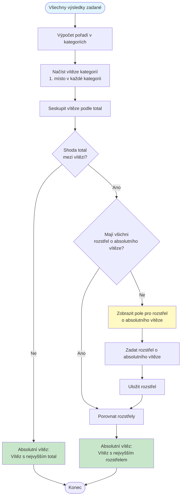

## Struktura rozstřelů

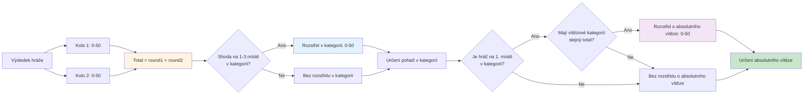

## Datový tok při zadávání výsledků

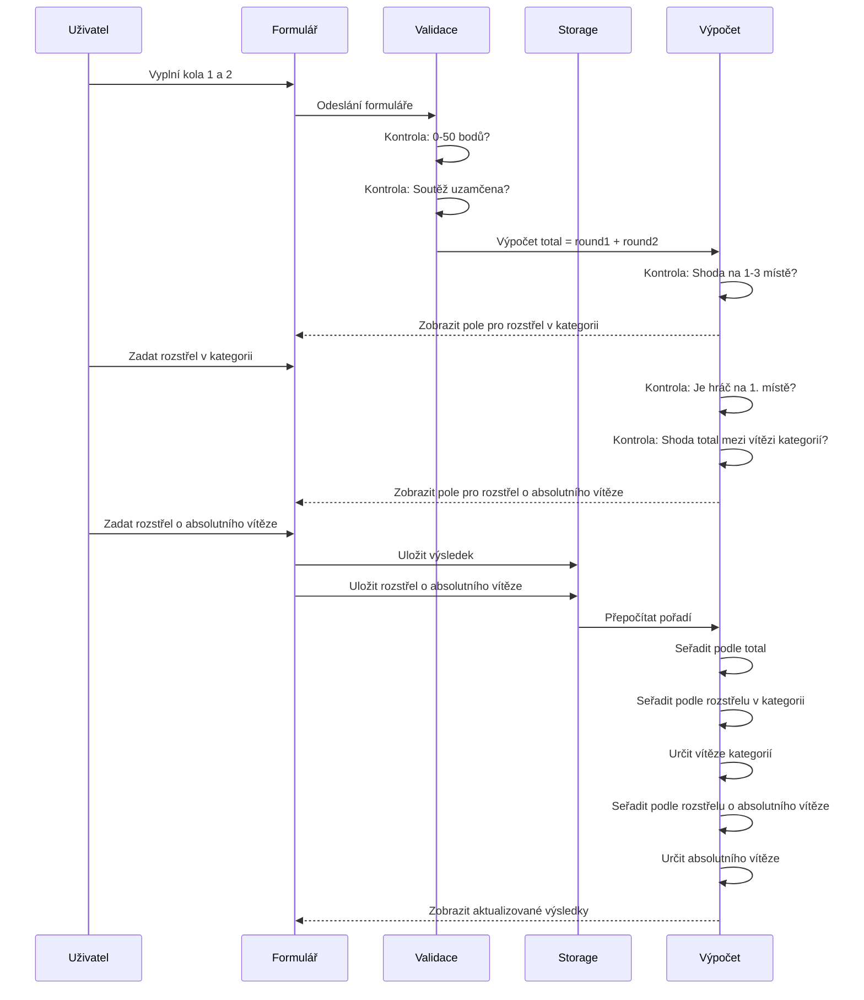

## Komponenty aplikace

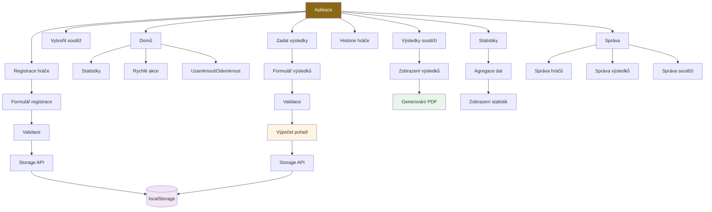

## Pravidla a validace

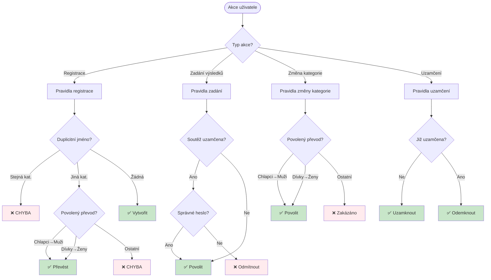

## Rozstřel - rozhodovací strom

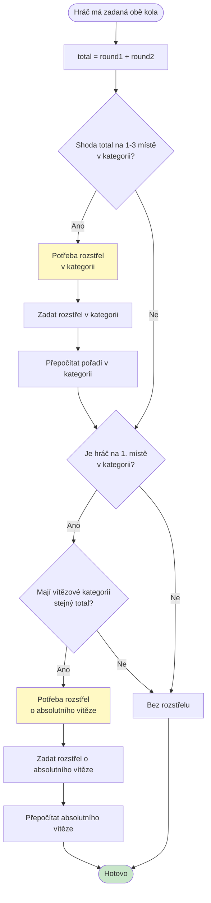

## Architektura ukládání dat

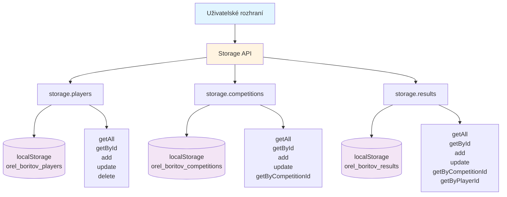

## Kompletní životní cyklus výsledku

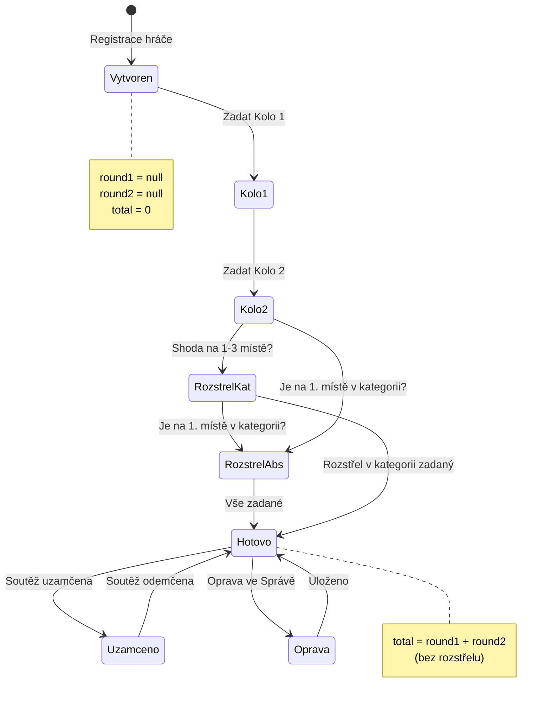

## Vztahy mezi entitami - detailní pohled

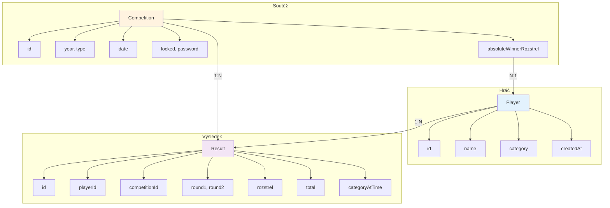

## Poznámky k diagramům

Všechny diagramy jsou vytvořené v Mermaid formátu a lze je zobrazit:
- V VS Code s rozšířením "Markdown Preview Mermaid Support"
- Na GitHub (automatické renderování)
- Online na https://mermaid.live/
- V HTML souboru `procesni-mapa-vizualizace.html`

